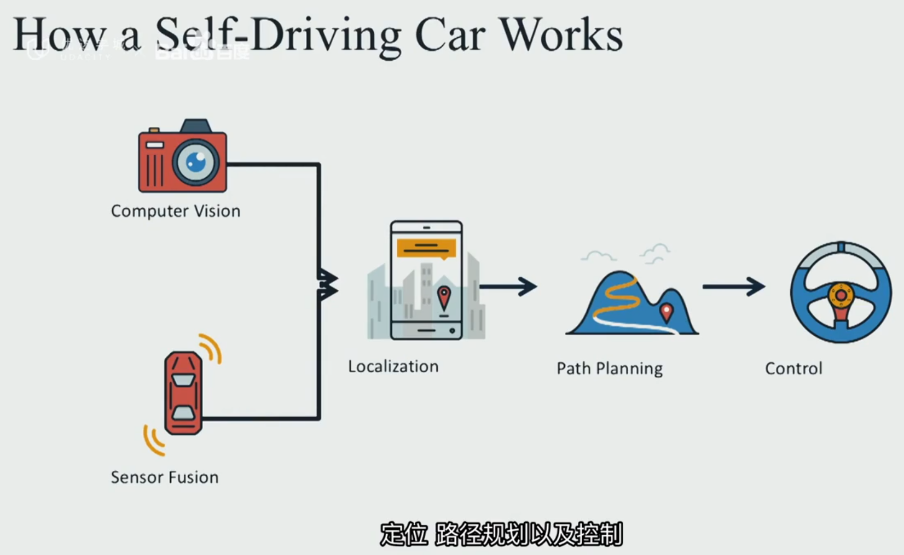
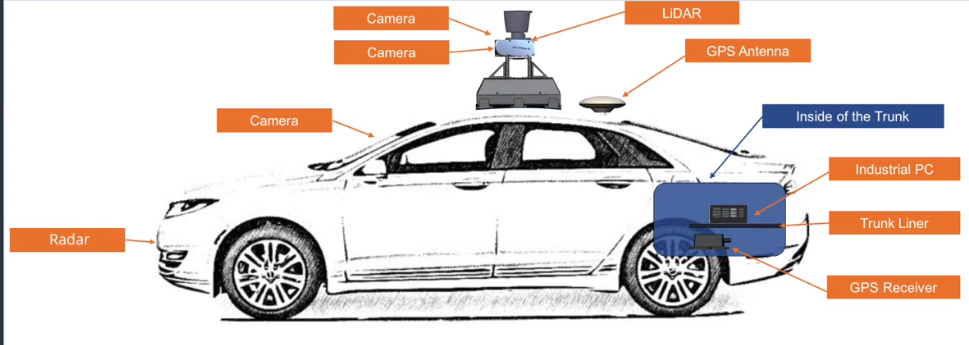
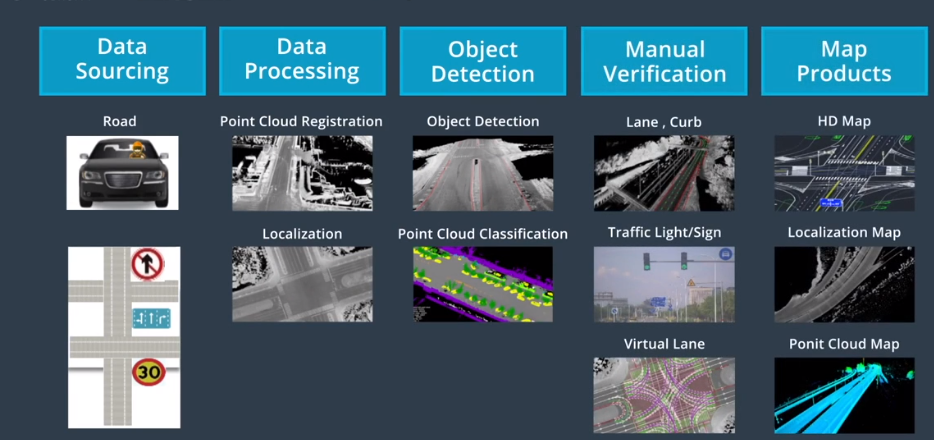
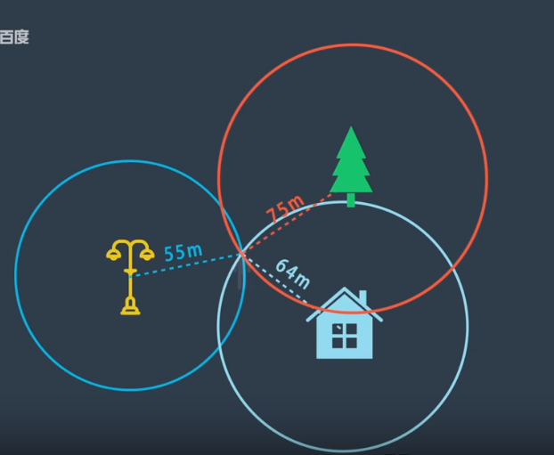
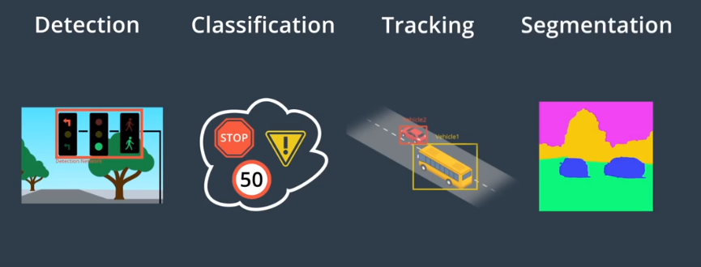
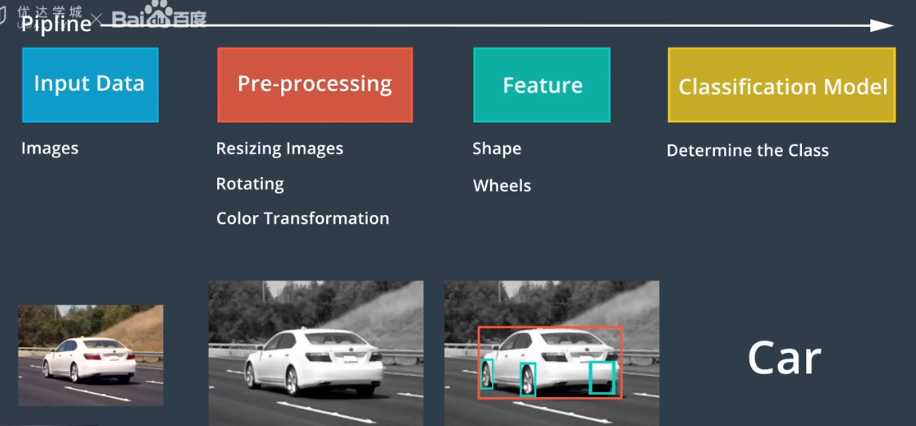
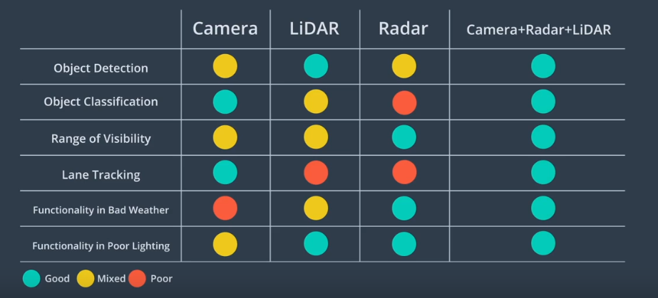

- 无人驾驶汽车的六个级别

  0-5，级别越高代表的智能化程度越高

  

- 自动驾驶工作原理

  传感器获取数据 -> 定位得到准确位置 -> 路径规划 -> 控制车辆行动

  

- 传感器构成

  雷达精度较低，但是便宜且能更好地应对各种复杂情况（天气等）

  

- 软件架构（三层）

  RTOS（实时操作系统）、ROS（机器人系统）、应用层

- CAN 协议在汽车中非常常用

- 高精度地图相当重要，至少厘米级的精度才能保证安全。然后汽车会根据传感器的数据进行定位（比如根据坐标和环境匹配），确定处在地图上的具体位置。高精度地图也能给汽车识别提供参考，比如某些目标位置的大概位置，方便系统缩小检测范围。也为路径规划提供非常用的参考。

  地图会记录一些不常变化且具有参考价值的标的，比如信号灯、人行道、天桥之类的。

- 高精度地图的构建步骤：数据采集（使用调查车辆去采集、维护、更新）、数据处理、目标识别、人工验证、地图发布。

  

### 定位

定位相当重要，就是在高精度地图找到你的位置（误差厘米级别），仅仅依靠 GPS 达不到这个精度

- GNSS-RTK

  通过三个点找到具体的位置，二维空间。通过 GPS 可以定位到具体位置，然后附近的基站设备也能校准这个位置，但是GPS 的更新频率很低。适合长时间和比较粗略地测量

  

- 惯性导航

  知道初始位置、初始速度、加速度还有时间，就能够得到当前的位置，而 IMU（惯性测量单元，包括加速度计、陀螺仪等）这种传感器能够满足这种测量要求需求。关键是频率足够快，适合短距离的测量。

- 激光雷达

  通过检测周围的的点来和高精度地图进行匹配，优点是稳健，缺点是高精度地图需要足够精确却保持最新。处理激光雷达的数据会采用一些滤波算法，诸如卡尔曼滤波。

- 视觉定位

  利用图像结合地图判断所处的位置，通过判断概率的方式来判断且不断更新状态，该过程是粒子滤波。有点是数据易于获取，缺点是没有三维信息要严重依赖地图。

- apollo 采用了多种定位方式融合，采用滤波算法（主要是卡尔曼滤波，这个算法牛呀）

### 感知

- 计算机视觉主要完成如下工作

  

​	使用图像分类器实现物体类别的识别，分类器一般工作步骤

​	

- 摄像头图像：将图片分成 RGB 三层进行处理

- 激光雷达通过发送激光测量物体的距离

- 机器学习可以帮助我们区分事物。通常有监督学习、半监督学习，无监督学习。

  强化学习会实现选择最好的效果的方式，对好的效果给予奖励，从而不断得到更好的方式。

- 神经网络：模拟人类神经元的行为，通过识别特征，并给这些特征赋予不同的权重，达到识别物体的作用。

- 反向传播算法：利用结果的误差反向回神经网络，然后调节神经网络的值，其实是一个负反馈调节的作用。

- 卷积神经网络（CNN）是神经网络的一种，原理比较复杂。

- 追踪有利于目标检测和预测

- 传感器的优劣势

  

### 预测

根据物体现在的一些特性，去预测其接下来的行为。

- 预测的结果要兼顾实时性和准确性。
- 预测方式分为基于模型预测（根据预定义的模型逐类判断，相当于加入了人类的经验和知识）和基于数据（用数据去训练）预测。

### 规划

规划好的行驶路线

- A* 算法可以帮助规划成本低的路线
- 路线规划涉及到多方面的考虑，比如信号线、别的车辆等事物
- 路线规划，一般先规划大的路线，然后规划具体的行驶路径和一些细节。

### 控制

- 一般控制三个活动（和人开车一样）：转向，加速和制动。
- 控制的目的是让车辆按既定轨迹行驶。
- PID 控制：简单，且大多数情况下效果非常好。
- 线性二次调节（LQR）控制。
- 模型预测控制（MPC）
