[哔哩哔哩- 朱有鹏《1-智能汽车时代开启了》](https://www.bilibili.com/video/BV1di4y1X7nF)：https://www.bilibili.com/video/BV1di4y1X7nF

- 新四化

  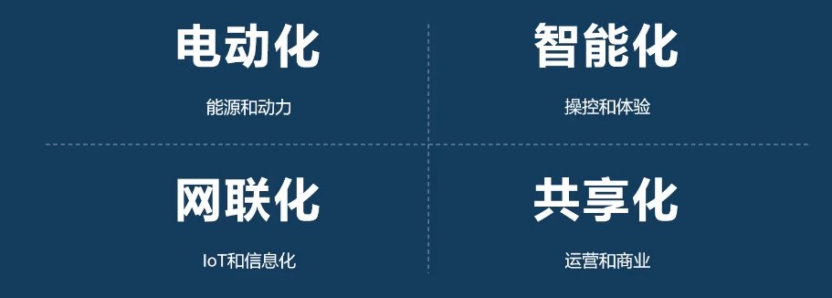

- 智能汽车的5大板块

  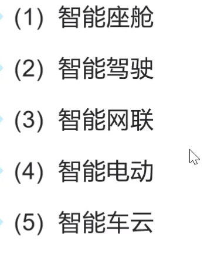

- 自动驾驶发展路径

  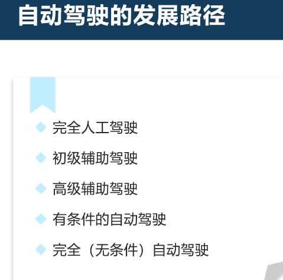

- 自动驾驶的优势和价值

  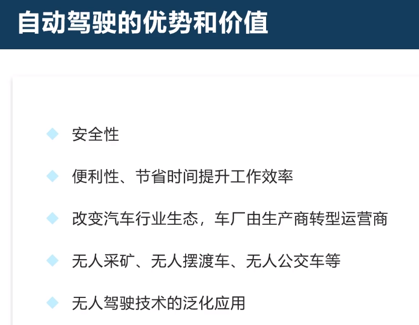

- 高度智能座舱

  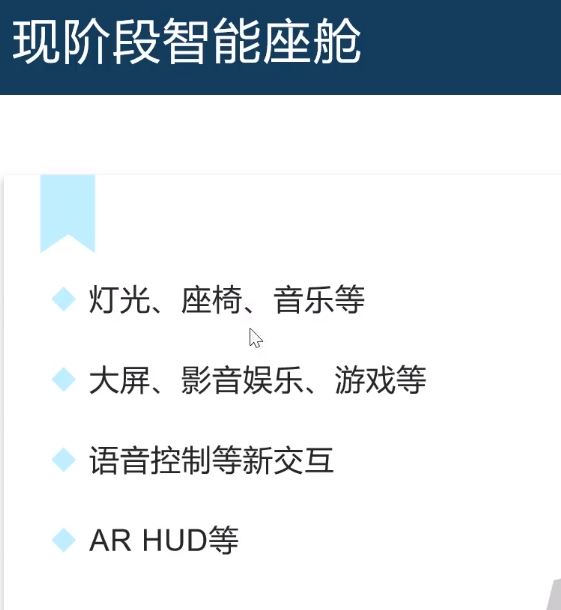

​	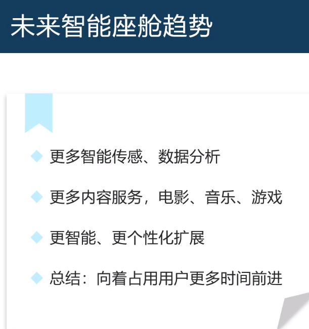

- 纯电动汽车

  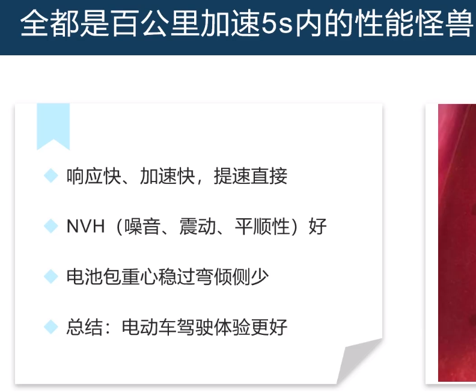

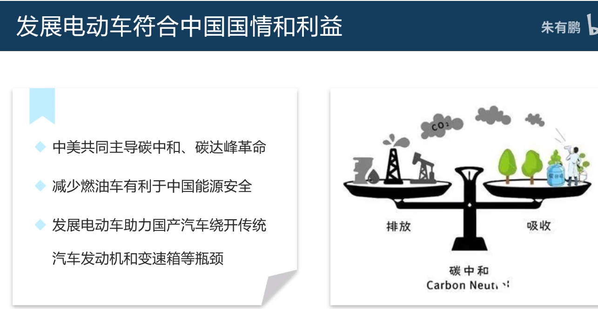

- 巨头们造车

  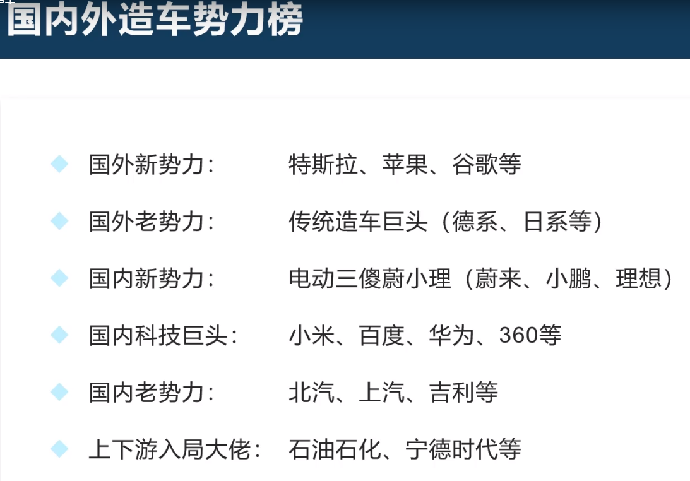

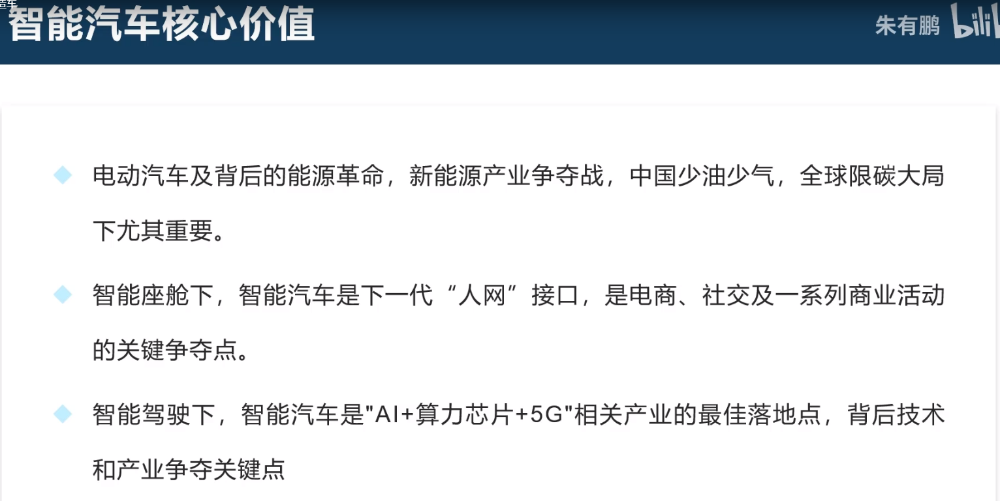

- 重要技术

  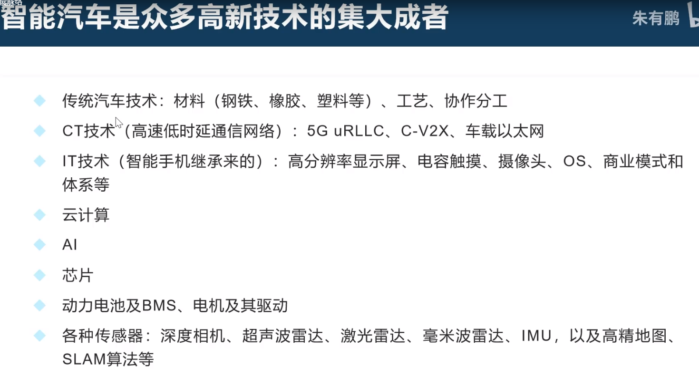

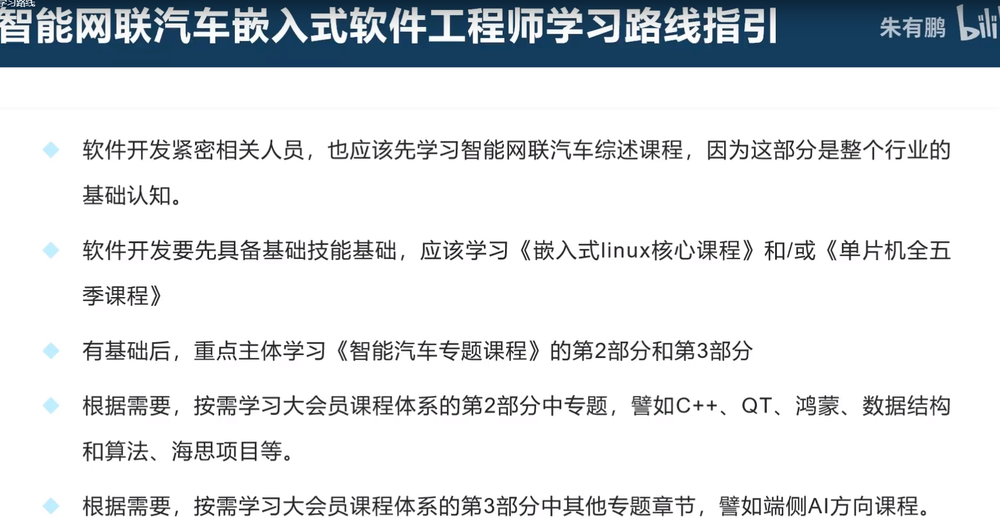

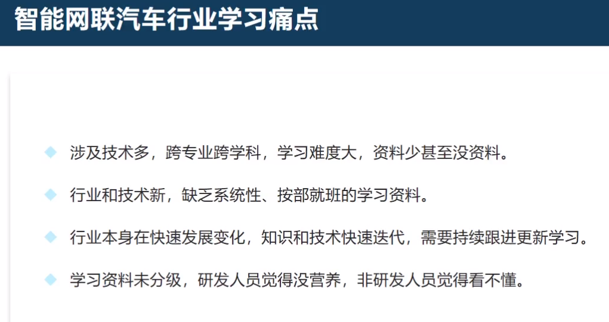